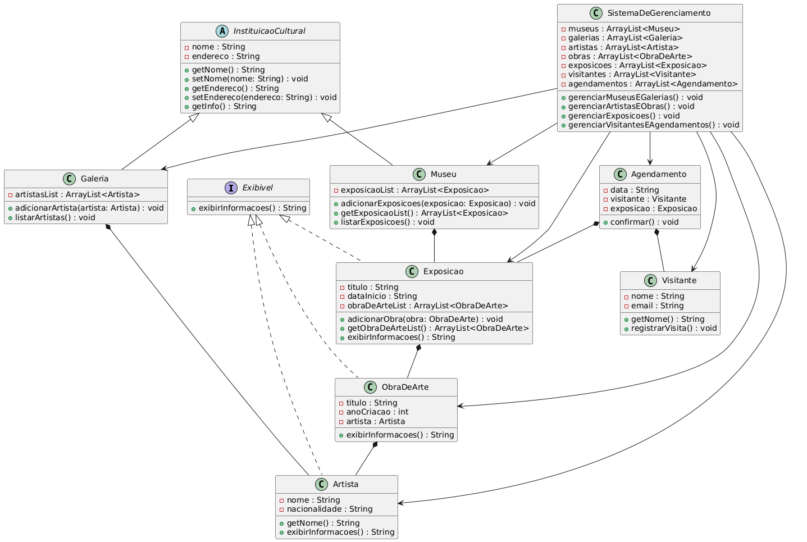

# A3Vitor

# 🎨 Aplicativo de Gerenciamento de Museus e Galerias de Arte

Este é um projeto de console em Java criado para gerenciar museus, galerias, artistas, obras de arte, exposições, visitantes e agendamentos de visitas. Desenvolvido como parte da Avaliação A3 da UC "Programação de Soluções Computacionais", com foco em orientação a objetos.

## 🧠 Objetivo

O objetivo do projeto é aplicar os conceitos de Programação Orientada a Objetos (POO), como herança, abstração, encapsulamento e polimorfismo, utilizando a linguagem Java. O sistema simula a administração de instituições culturais e a interação com o público por meio de exposições e agendamentos.

## 🏛️ Funcionalidades

- Cadastro e listagem de **museus** e **galerias de arte**.
- Cadastro de **artistas** e suas **obras de arte**.
- Criação de **exposições** com obras selecionadas.
- Cadastro de **visitantes**.
- **Agendamento de visitas** a exposições.
- Associação de artistas a galerias.
- Menus interativos via console.

## 🧱 Estrutura do Projeto

O projeto está organizado em pacotes e segue os princípios da Programação Orientada a Objetos.

### 🗂️ Pacotes:

- `Domain`: Contém a `Main` e classes principais do sistema.
- `Domain.Heranca`: Contém a classe abstrata `InstituicaoCultural` e suas subclasses `Museu` e `Galeria`.
- `Domain.Interfaces`: Contém a interface `Exibivel`.
- `Domain.Gerenciamento`: Contém classes de controle do sistema (`Artista`, `ObraDeArte`, `Exposicao`, `Visitante`, `Agendamento`).

## ▶️ Execução

1. Clone o repositório:

   ```bash
   git clone https://github.com/uKeps/A3Vitor.git
   
## 👥 Integrantes

- Erik Piassini
- João Santos

